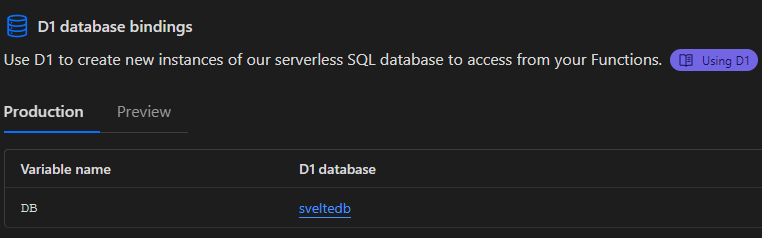

# SvelteKit - Lucia Auth - Cloudflare Pages - Drizzle ORM Template

## Developing

1. Install dependencies (or npm install),

```
  bun install
```

2. Rename wrangler.example.toml to wrangler.toml
3. Login to wranger

```
  bun wrangler login
```

4. Setup Database (npm run wrangler...)

```
  bun wrangler d1 create <DBName>
```

5. Paste the response in wrangler.toml, example:

```
[[d1_databases]]
binding = "DB"
database_name = "sveltedb"
database_id = "11fba10e-2d8f-3212-adc6-d430e2e8a81a"

```

6. Migrate schema to local database

```
bun d1:mig:local
```

7. Run app (Do both of the following at the same time)

```
bun proxy
bun dev
```

## Deployment

1. Migrate schema to production database

```
bun d1:mig:prod
```

2. Create web app in Cloudflare
3. Bind database to your app


